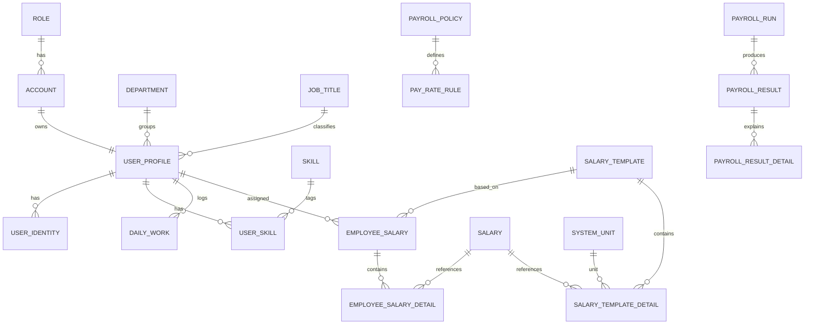

# ERP Project Architecture Scan

This file is a working reference for understanding the current Spring Boot codebase in `com.dat.erp`.

## 1. High-Level Shape

- App type: single-module Spring Boot 3.5.4 application
- Java: 17
- Build: Maven wrapper (`mvnw`)
- Main package: `com.dat.erp`
- Persistence: Spring Data JPA
- Mapping: MapStruct
- Boilerplate reduction: Lombok
- Auth style: JWT via cookie or `Authorization: Bearer`
- Database style: soft-delete and audit fields on most business entities

The dominant runtime path is:

```text
HTTP Request
-> Controller
-> Service
-> Repository
-> Entity
-> Mapper / Response DTO
-> HTTP Response
```

Cross-cutting concerns sit around that path:

```text
SecurityFilterChain
-> RequestIdFilter
-> AuthenticationFilter
-> SecurityContextService
-> Controller @PreAuthorize
-> GlobalExceptionHandler
```

## 2. Package Structure

### Entry / config

- `ErpApplication`: Spring Boot bootstrap class
- `systemconfigs/`
  - `SecurityConfig`: auth rules, whitelist, filters, CORS, 401/403 handlers
  - `JpaAuditingConfig`: auditor and UTC timestamp provider
  - `SwaggerConfig`: OpenAPI setup
  - `MailSenderConfig`, `SchedulingConfig`, `AsyncConfig`
  - `CustomUserDetails`: authenticated principal shape

### Web/API layer

- `controllers/`: REST endpoints
- `handlers/GlobalExceptionHandler`: maps exceptions to problem-details style responses
- `filters/`
  - `AuthenticationFilter`: extracts JWT, loads current user
  - `RequestIdFilter`: request correlation support

### Business layer

- `services/`: service interfaces
- `services/impl/`: concrete business logic
- `services/base/AbstractAuditableService`: shared code generation and audit population

### Persistence / domain

- `entities/`: JPA entities
- `repositories/customrepositories/`: Spring Data JPA repositories
- `repositories/projections/`: projection interfaces for optimized queries

### Data contracts / conversion

- `dto/request/`: request payloads and query request models
- `dto/response/`: response payloads
- `mapper/interfaces/`: MapStruct entity/DTO mappers
- `converters/`: encryption/hash converters

### Shared support

- `constants/`: enums, role names, messages, prefixes
- `utils/`: JWT, cookies, paging, crypto, env parsing, string helpers
- `builders/ResponseBuilder`: wraps some controller responses

## 3. Runtime Backbone

### Authentication and request processing

1. `SecurityConfig` loads whitelist URLs from `EnvironmentVariable`.
2. `AuthenticationFilter` skips whitelist routes.
3. For protected routes it reads token from:
   - `Authorization: Bearer ...`
   - `AUTH_TOKEN` cookie
4. `JwtUtils` extracts account code.
5. `SecurityContextServiceImpl.setCurrentUser(accountCode)` loads:
   - `Account`
   - `UserProfile`
   - wraps them in `CustomUserDetails`
6. Method-level authorization uses `@PreAuthorize`.
7. Exceptions are normalized by `GlobalExceptionHandler`.

### Audit and code generation

Most write services extend `AbstractAuditableService`.

It centralizes:

- `generateCodeIfMissing(entity, prefix)`
- `applyInsertAudit(entity)`
- `applyUpdateAudit(entity)`
- current user/company resolution from `SecurityContextService`

This means most created entities receive:

- `code`
- `createdAt`, `updatedAt`
- `createdBy`, `updatedBy`
- `companyCode`

from the same shared base flow.

## 4. Implemented API Surface

These controllers are actively wired to services:

| Area | Controller | Main service |
|---|---|---|
| Authentication | `AuthenticationController` | `AuthenticationServiceImpl` |
| Company | `CompanyController` | `CompanyServiceImpl` |
| Department | `DepartmentController` | `DepartmentServiceImpl` |
| Employee | `EmployeeController` | `EmployeeAccountServiceImpl` |
| User profile options | `UserProfileController` | `UserProfileServiceImpl` |
| Role options | `RoleController` | `RoleServiceImpl` |
| System unit options | `SystemUnitController` | `SystemUnitServiceImpl` |
| Salary components | `SalaryController` | `SalaryServiceImpl` |
| Salary templates | `SalaryTemplateController` | `SalaryTemplateServiceImpl` |
| Employee salary | `EmployeeSalaryController` | `EmployeeSalaryServiceImpl` |
| Employee daily work | `EmployeeDailyWorkController` | `EmployeeDailyWorkServiceImpl` |

Special case:

- `EmployeeSalaryDetailController` exists but currently exposes no endpoints.

## 5. Main Function Call Relationships

## 5.1 Company creation

```text
POST /api/companies
-> CompanyController.createCompany
-> CompanyServiceImpl.createCompany
-> CompanyMapper.toEntity
-> CompanyRepository.save
-> CompanyDefaultSetupService.setAccountDefault
   -> AccountService.createDefaultAccount
   -> EmailService.sendCreateAccountMail
-> CompanyDefaultSetupService.setDepartmentDefault
   -> DepartmentService.createDefaultDepartment
```

Important behavior:

- checks duplicate company email and tax number
- generates `Company.secretKey`
- generates company code
- creates default account and default department after company creation

## 5.2 Login / password reset

```text
POST /api/auth/login
-> AuthenticationController
-> AuthenticationServiceImpl.login
-> AccountRepository.findByEmail
-> CryptoUtils.verifyHash
-> JwtUtils.generateToken
-> CookieUtils.addTokenCookie
-> Account.lastLogin update
```

```text
POST /api/auth/reset-password
-> AuthenticationServiceImpl.resetPassword
-> SecurityContextService.getCurrentUser
-> AccountRepository.findByCode
-> CryptoUtils.verifyHash
-> CryptoUtils.hash
-> AccountRepository.save
```

## 5.3 Employee creation

```text
POST /api/v1/employees
-> EmployeeController.createEmployee
-> EmployeeAccountServiceImpl.createEmployee
-> RoleRepository.findByCode/findByName
-> EmployeeAccountMapper.toAccount
-> AccountRepository.save
-> EmployeeAccountMapper.toUserProfileCreateRequest
-> UserProfileServiceImpl.createUserProfile
   -> AccountRepository.findByCode
   -> DepartmentRepository.findByCodeAndCompanyCode
   -> UserProfileMapper.toUserProfile
   -> UserProfileRepository.save
-> EmailService.sendCreateAccountMail
-> UserProfileMapper.toEmployeeResponse
```

Important behavior:

- enforces current user company scope
- blocks admin/system-admin employee creation through this endpoint
- generates random password with `PasswordGenerator`
- hashes password before saving
- sends welcome email asynchronously-ish inside a guarded helper

## 5.4 Employee list

```text
GET /api/v1/employees
-> EmployeeController.getEmployees
-> EmployeeAccountServiceImpl.getEmployees
-> dynamic Specification<UserProfile>
-> UserProfileRepository.findAll(spec, pageable)
-> UserSkillRepository.findSkillRowsByUserProfileIds
-> map to EmployeeListItem
```

Notable points:

- role-based visibility logic is enforced in service code
- filters include keyword, age, departments, skills, active/inactive status
- `UserProfileRepository` uses `JpaSpecificationExecutor`
- skills are fetched separately through projection `EmployeeSkillRow`

## 5.5 Salary component creation and lookup

```text
POST /api/salaries
-> SalaryController.createSalaries
-> SalaryServiceImpl.createSalaries
-> SalaryMapper.toEntities
-> SalaryRepository.saveAll
-> SalaryMapper.toResponses
```

```text
GET /api/salaries
GET /api/salaries/options
-> SalaryServiceImpl
-> SalaryRepository custom queries
-> mapped to SalaryListResponse / SelectionOptionResponse
```

## 5.6 Salary template creation

```text
POST /api/salary-templates
-> SalaryTemplateController.createSalaryTemplate
-> SalaryTemplateServiceImpl.createSalaryTemplate
-> validate dates
-> validate request total against detail sum
-> SalaryTemplateRepository.existsOverlappingByNameAndCompanyCode
-> SalaryTemplateMapper.toEntity
-> SalaryTemplateRepository.save
-> SalaryTemplateDetailServiceImpl.createSalaryTemplateDetails
   -> SalaryRepository.findAllByCodeIn
   -> SystemUnitRepository.findAllByCodeIn
   -> SalaryTemplateDetailRepository.saveAll
-> SalaryTemplateMapper.toResponse
```

Important behavior:

- template total is recomputed from details
- overlapping active periods for same template name are blocked
- detail rows reference salary component and system unit

## 5.7 Employee salary creation

```text
POST /api/employee-salaries
-> EmployeeSalaryController.createEmployeeSalary
-> EmployeeSalaryServiceImpl.createEmployeeSalary
-> CompanyRepository.findByCode
-> UserProfileRepository.findByCode
-> EmployeeSalaryRepository.existsOverlappingByUserProfileCodeAndCompanyCode
-> EmployeeSalaryMapper.toEntity
-> encrypt totalAmount with Company.secretKey
-> EmployeeSalaryRepository.save
-> EmployeeSalaryDetailServiceImpl.createEmployeeSalaryDetails
   -> EmployeeSalaryRepository.findByCodeAndIsDeletedFalse
   -> SalaryRepository.findByCode
   -> EmployeeSalaryDetailRepository.saveAll
-> EmployeeSalaryMapper.toResponse
```

Important behavior:

- `EmployeeSalary.totalAmount` is stored encrypted
- company secret key is mandatory
- employee must belong to current company and be active
- effective date overlap is blocked

## 5.8 Daily work creation and lookup

```text
POST /api/employee-daily-works
-> EmployeeDailyWorkController.createEmployeeDailyWorks
-> EmployeeDailyWorkServiceImpl.createEmployeeDailyWorks
-> UserProfileRepository.findByCode
-> DailyWorkRepository.existsByUserProfile_CodeAndWorkingDateAndIsDeletedFalse
-> calculateHoursWorked
-> DailyWorkRepository.saveAll
```

```text
GET /api/employee-daily-works
-> EmployeeDailyWorkServiceImpl.getEmployeeDailyWorks
-> DailyWorkRepository.findEmployeeDailyWorksByFilters
-> projection EmployeeDailyWorkListProjection
-> EmployeeDailyWorkListResponse
```

Important behavior:

- deduplicates input batch by `userProfileCode + workingDate`
- prevents duplicate work log for same employee/date
- computes `hoursWorked` from start/end and overtime

## 6. Entity Model

## 6.1 Base audit model

Most entities extend `BaseAuditableEntity`:

- `id`
- `code`
- `createdAt`
- `updatedAt`
- `createdBy`
- `updatedBy`
- `companyCode`
- `isDeleted`

This is the common backbone of the domain.

## 6.2 Core active HR/account entities

### `Role`

- Fields: `name`, `type`, `description`, `isPublic`
- Referenced by `Account.role`

### `Account`

- Fields: `email`, `passwordHash`, `isActive`, `lastLogin`, `numberToken`
- Relations:
  - `ManyToOne -> Role`
  - `OneToOne -> UserProfile`

### `Department`

- Fields: `name`, `description`, `status`
- Relations:
  - `OneToMany -> UserProfile`

### `UserProfile`

- Fields: `firstName`, `lastName`, `managerCode`, `employeeNumber`, `phoneNumber`, `birthDate`, `hireDate`, `isActive`
- Relations:
  - `OneToOne -> Account`
  - `ManyToOne -> Department`
  - `ManyToOne -> JobTitle`
  - `OneToMany -> UserIdentity`
  - `OneToMany -> UserSkill`
  - `OneToMany -> EmployeeSalary`
  - `OneToMany -> EmployeePto`
  - `OneToMany -> DailyWork`

### `UserIdentity`

- Fields: `idType`, `idValue`, `issuedDate`, `expiryDate`
- Relation:
  - `ManyToOne -> UserProfile`

### `Skill`

- Fields: `name`, `category`

### `UserSkill`

- Fields: `proficiency`, `years`, `addedAt`
- Relations:
  - `ManyToOne -> UserProfile`
  - `ManyToOne -> Skill`

### `JobTitle`

- Fields: `title`, `level`, `description`

## 6.3 Active payroll/salary entities

### `Salary`

- Fields: `name`, `calculateMethod`, `isDeduct`
- Reusable salary component, used by templates and employee salary details

### `SystemUnit`

- Fields: `name`, `description`, `type`
- Relations:
  - `OneToMany -> SystemUnitDetail (from)`
  - `OneToMany -> SystemUnitDetail (to)`

### `SystemUnitDetail`

- Fields: `exchangeQuantity`
- Relations:
  - `ManyToOne -> SystemUnit from`
  - `ManyToOne -> SystemUnit to`

### `SalaryTemplate`

- Fields: `name`, `description`, `totalAmount`, `effectiveFrom`, `effectiveTo`, `currency`
- Relations:
  - `OneToMany -> SalaryTemplateDetail`
  - `OneToMany -> EmployeeSalary`

### `SalaryTemplateDetail`

- Fields: `amount`, `quantity`, `sequenceOrder`
- Relations:
  - `ManyToOne -> SalaryTemplate`
  - `ManyToOne -> Salary`
  - `ManyToOne -> SystemUnit`

### `EmployeeSalary`

- Fields: `effectiveFrom`, `effectiveTo`, `totalAmount`, `currency`
- Relations:
  - `ManyToOne -> UserProfile`
  - `ManyToOne -> SalaryTemplate`
  - `OneToMany -> EmployeeSalaryDetail`

### `EmployeeSalaryDetail`

- Fields: `amount`, `dailyWorkWorkType`
- Relations:
  - `ManyToOne -> Salary`
  - `ManyToOne -> EmployeeSalary`
  - `ManyToOne -> Salary dependenceCode`

### `DailyWork`

- Fields: `quantity`, `unit`, `startTime`, `endTime`, `otTime`, `usedPto`, `workingDate`, `workType`, `hoursWorked`
- Relation:
  - `ManyToOne -> UserProfile`

### `EmployeePto`

- Fields: `type`, `startDate`, `endDate`, `days`, `status`, `processedBy`, `requestedAt`, `processedAt`
- Relation:
  - `ManyToOne -> UserProfile`

## 6.4 New payroll engine entities present in model only

These entities exist in `entities/` but are not yet wired into controllers/services/repositories in the current implementation:

### `PayrollPolicy`

- Fields: `prorationBasis`, `standardDaysPerWeek`, `payHolidayIfOff`, `roundingRule`, `effectiveFrom`, `effectiveTo`
- Relation:
  - `OneToMany -> PayRateRule`

### `PayRateRule`

- Fields: `dayType`, `multiplier`, `appliesTo`, `effectiveFrom`, `effectiveTo`
- Relation:
  - `ManyToOne -> PayrollPolicy`

### `PayrollRun`

- Fields: `period`, `status`, `runAt`, `closedAt`
- Relation:
  - `OneToMany -> PayrollResult`

### `PayrollResult`

- Fields: `amount`, `quantity`, `sourceType`, `isRetro`, `retroReason`
- Relations:
  - `ManyToOne -> PayrollRun`
  - `ManyToOne -> UserProfile`
  - `ManyToOne -> Salary`
  - `ManyToOne -> SystemUnit`
  - `OneToMany -> PayrollResultDetail`

### `PayrollResultDetail`

- Fields: `calcBasis`, `basisDays`, `paidDays`, `unpaidDays`, `ratePerDay`, `multiplierApplied`, `formulaNote`
- Relation:
  - `ManyToOne -> PayrollResult`

### `CompanyCalendar` / `CalendarDate`

- `CompanyCalendar` relates to `Company`
- `CalendarDate` relates to `CompanyCalendar`
- they appear prepared for holiday/workday logic but are not part of active request flows yet

## 7. Entity Relationship View



## 8. DTO Landscape

## 8.1 Request DTOs by feature

### Authentication

- `LoginRequest`
- `ResetPasswordRequest`

### Company / department

- `CompanyRequest`
- `DepartmentRequest`

### Employee

- `CreateEmployeeRequest`
- `UserProfileCreateRequest`
- `EmployeeListRequest`
- `PaginationRequest`

### Salary / template / employee salary

- `SalaryRequest`
- `SalaryTemplateRequest`
- `SalaryTemplateDetailRequest`
- `EmployeeSalaryRequest`
- `EmployeeSalaryDetailRequest`

### Work / email

- `EmployeeDailyWorkRequest`
- `EmailRequest`

### Search helper

- `EmployeeScheduleFilter` (record)

## 8.2 Response DTOs by feature

### Common wrappers

- `CustomApiResponse<T>`
- `PagedResponse<T>`
- `PaginationResponse<T>`
- `SelectionOptionResponse`

### Authentication

- `LoginResponse`

### Company / department

- `CompanyResponse`
- `CompanyDetailResponse`
- `department/DepartmentResponse`

### Employee

- `EmployeeResponse`
- `employee/EmployeeListItem`

### Salary / template / employee salary

- `SalaryResponse`
- `SalaryListResponse`
- `SalaryTemplateResponse`
- `SalaryTemplateListResponse`
- `SalaryTemplateDetailListResponse`
- `EmployeeSalaryResponse`
- `EmployeeSalaryListResponse`

### Work logs

- `EmployeeDailyWorkListResponse`

### Error payloads

- `ProblemDetailsResponse`
- `ValidationProblemDetailsReponse`
- `ErrorResponse`

## 8.3 DTO-to-entity mapping relationships

Main explicit MapStruct mappings:

| Mapper | Input | Output |
|---|---|---|
| `CompanyMapper` | `CompanyRequest` | `Company`, `CompanyResponse` |
| `DepartmentMapper` | `DepartmentRequest` | `Department`, `DepartmentResponse` |
| `SalaryMapper` | `SalaryRequest` | `Salary`, `SalaryResponse` |
| `SalaryTemplateMapper` | `SalaryTemplateRequest` | `SalaryTemplate`, `SalaryTemplateResponse`, `SalaryTemplateListResponse` |
| `EmployeeSalaryMapper` | `EmployeeSalaryRequest` | `EmployeeSalary`, `EmployeeSalaryResponse` |
| `EmployeeAccountMapper` | `CreateEmployeeRequest` | `Account`, `UserProfileCreateRequest` |
| `UserProfileMapper` | `UserProfileCreateRequest` | `UserProfile`, `EmployeeResponse` |
| `EmailMapper` | `EmailRequest` | `Email` |

Patterns:

- primitive normalization and richer business validation happen mostly in services, not controllers
- MapStruct handles structural transformation
- service layer fills in references, audit fields, codes, encryption, and ownership checks

## 9. Repository Design Notes

The repositories mix:

- standard Spring Data finder methods
- custom JPQL queries with optional filters
- projections for read-heavy list endpoints
- specifications for employee search

Important repositories:

- `UserProfileRepository`
  - `JpaSpecificationExecutor`
  - option query for dropdowns
  - entity graph for account + department
- `DailyWorkRepository`
  - duplicate check by employee/date
  - projected list query for work log listing
- `SalaryTemplateRepository`
  - overlap detection
  - filtered list/options queries
- `EmployeeSalaryRepository`
  - overlap detection
  - filtered search for assigned salary periods
- `UserSkillRepository`
  - batch skill projection lookup for employee list

## 10. What Is Fully Implemented vs Partial

### Clearly implemented business slices

- authentication and password reset
- company creation with default setup
- department creation and listing
- employee account/profile creation
- employee listing with dynamic filters
- salary component management
- salary template management
- employee salary assignment
- employee daily work logging
- email persistence and retry sending

### Present but only partially exposed

- `EmployeeSalaryDetailServiceImpl` is used internally, but not exposed directly through controller endpoints
- company search endpoint ignores `searchKey` and `searchValue` in practice and just pages all companies

### Present in model, not yet integrated

- payroll policy / pay rate engine
- payroll run / result calculation engine
- company calendar / holiday logic
- richer PTO workflow
- fuller job title / identity / skill CRUD APIs

## 11. Important Design Characteristics

### Company scoping

Many services resolve company from the authenticated account and reject cross-company access. This is one of the main invariants in the system.

### Soft delete

Entities carry `isDeleted`, and many queries explicitly filter on `isDeleted = false`.

### Encryption

- `EmployeeSalary.totalAmount` is encrypted with `Company.secretKey`
- some converters/utilities suggest broader encryption support (`EncryptFieldConverter`, `CompanySecretKeyCryptoUtils`, `CryptoUtils`)

### Generated business codes

Business objects use generated codes instead of exposing numeric IDs as the main public reference.

### DTO-first API boundary

Controllers accept DTOs and almost never expose entities directly.

## 12. Useful Entry Points for Future Work

If you need to understand or extend the project quickly, start here:

1. `controllers/EmployeeController.java`
2. `services/impl/EmployeeAccountServiceImpl.java`
3. `services/impl/SalaryTemplateServiceImpl.java`
4. `services/impl/EmployeeSalaryServiceImpl.java`
5. `services/impl/EmployeeDailyWorkServiceImpl.java`
6. `services/base/AbstractAuditableService.java`
7. `systemconfigs/SecurityConfig.java`
8. `entities/UserProfile.java`
9. `entities/EmployeeSalary.java`
10. `entities/PayrollPolicy.java`

## 13. Current Caveats

- `SalaryTemplateServiceImplTest` is already noted as failing because of missing `SecurityContextService` wiring/mocking.
- The payroll-policy/pay-rate/payroll-result entities are domain scaffolding today, not a complete feature path.
- Some legacy naming remains inconsistent, for example `repositories/customrepositories/`.

